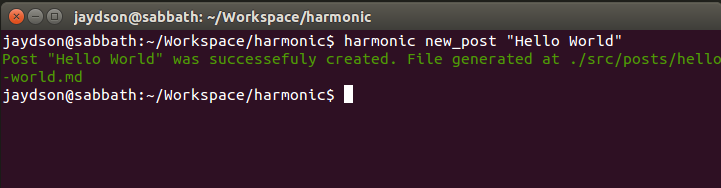

# Blogging with Harmonic

Harmonic follow the pattern of others static site generators you may know.  
You must write your posts in [Markdown](http://daringfireball.net/projects/markdown/) format.  

## New post:  
```
harmonic new_post "Hello World"
```


After running **_new_post_**, the markdown file will be generated in _**/src/posts/**_ folder.  

### Markdown header
The markdown file have a header which defines the post meta-data.  
Example:  
```markdown
<!--
layout: post
title: hello world
date: 2014-05-17T08:18:47.847Z
comments: true
published: true
keywords: JavaScript, ES6
description: Hello world post
categories: JavaScript, ES6
authorName: Jaydson
-->
```
You can check all possible header values in the [header page](markdown-header.md).  

### Markdown content
Everything after the header is the post content.  
Example:  
```markdown
# Hello World  
This is my awesome post using [harmonic](https://github.com/es6rocks/harmonic).  

This is a list:  
- Item 1
- Item 2
- Item 3
```
The code above will be parsed to something like this:  
```html
<h1 id="hello-world">Hello World</h1>
<p>
  This is my awesome post using
  <a href="https://github.com/es6rocks/harmonic">harmonic</a>.
</p>
<p>This is a list:  </p>
<ul>
<li>Item 1</li>
<li>Item 2</li>
<li>Item 3</li>
</ul>
```

[<<< Configuring Harmonic](config.md) | [Markdown Header >>>](markdown-header.md)
