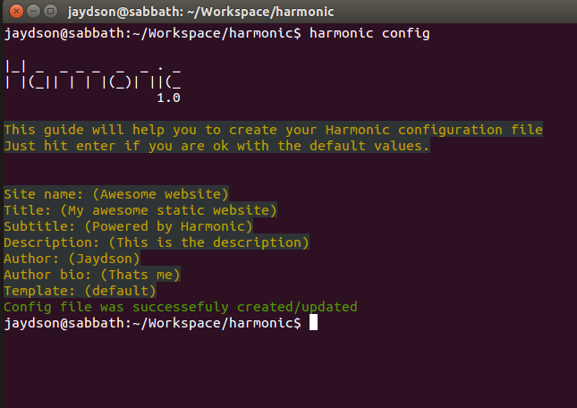

# Config

The Harmonic config file is a simple JSON object.  
You can configure your static website with the CLI _config_ command:  
```shell
harmonic config
```


Feel free to open and change your harmonic config file, actually some of these configurations aren't available on the command line helper.  
So, let's check the full config file:  
<table>
  <tr>
    <td>
       <strong>key</strong>
    </td>
    <td>
       <strong>value</strong>
    </td>
    <td>
       <strong>example</strong>
    </td>
 </tr>
 <tr>
  <tr>
    <td>
       name
    </td>
    <td>
       The name of your website
    </td>
    <td>
       <i>My awesome blog</i>
    </td>
 </tr>
 <tr>
    <td>
       title
    </td>
    <td>
       The title of your webiste
    </td>
    <td>
       <i>My awesome title</i>
    </td>
 </tr>
 <tr>
    <td>
       domain
    </td>
    <td>
       The domain of your website - NOT IMPLEMENTED YET*
    </td>
    <td>
       <i>http://es6rocks.com</i>
    </td>
 </tr>
 <tr>
    <td>
       subtitle
    </td>
    <td>
       The subtitle of your website - NOT IMPLEMENTED YET*
    </td>
    <td>
       <i>My awesome subtitle</i>
    </td>
 </tr>
 <tr>
    <td>
       author
    </td>
    <td>
       Your name
    </td>
    <td>
       <i>John da Silva</i>
    </td>
 </tr>
 <tr>
    <td>
       keywords
    </td>
    <td>
       The keywords of the page or post - NOT IMPLEMENTED YET*
    </td>
    <td>
      <i>JavaScript, HTML5, CSS3</i>
    </td>
 </tr>
 <tr>
    <td>
       description
    </td>
    <td>
       Some description of your website
    </td>
    <td>
       <i>Just a description</i>
    </td>
 </tr>
 <tr>
    <td>
       template
    </td>
    <td>
       The template you choose to use
    </td>
    <td>
      <i>default</i>
    </td>
 </tr>
 <tr>
    <td>
       posts_permalink
    </td>
    <td>
       The posts permalink of your website
    </td>
    <td>
      <i>:year/:month/:title</i>
    </td>
  </tr>
 <tr>
    <td>
       pages_permalink
    </td>
    <td>
       The pages permalink of your website
    </td>
    <td>
       <i>pages/:title</i>
    </td>
  </tr>
</table>

All this information are available in any template as _**config**_.  

[<<< Installing](installing.md) | [Blogging >>>](blogging.md)
