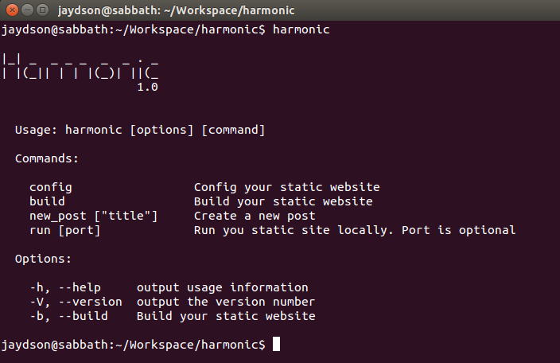

# Installing

## Prerequirements

- Node.js >= 0.10 or io.js.
- npm.

## Simple installation

Harmonic is available on npm:

```shell
npm install harmonic -g
```

## Bleeding edge installation

You can install Harmonic directly from the GitHub repository:

```shell
git clone https://github.com/es6rocks/harmonic.git
cd harmonic
npm link
```

If everything is ok, you can type `harmonic` in your terminal, and you will get the harmonic menu:  


[<<< Index](README.md) | [Config >>>](config.md)
